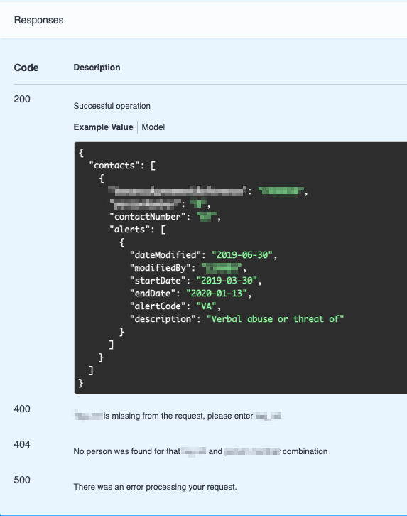
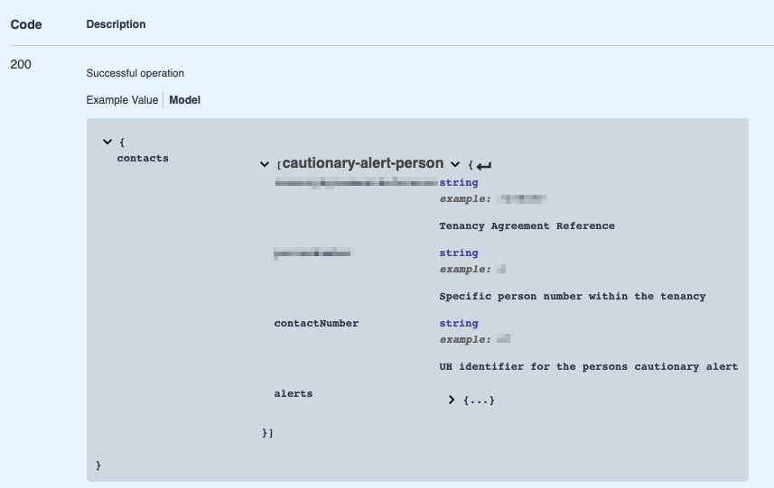

# Swagger Documentation

## Introduction:

At Hackney, we believe in working in a collaborative way and this is embedded into our API development process. Before commencing the implementation stage, each API endpoint will first need to be documented using SwaggerHub.

The benefits of this include:
- Open specification standards;
- Opportunity to mock the API and avoid possible blockers for front end development;
- Opportunity to share and reach a common agreement of what the API request and response should look like before any work has commenced;
## Purpose:

The documentation aids our collaboration process, as it is shared with the whole team. People, both from technical and non-technical backgrounds, can provide feedback and request changes. This can save hours of development and also ensures that every team member has an understanding of the main question — what will this API do?

We have chosen SwaggerHub as a tool to document our APIs as it contributes to the efficiency of our development process, by giving us a central point of reference, built collaboratively, with a defined objective for the eventual shape of the API.

## What is SwaggerHub?:

** You can start by watching our overview video: **

<figure class="video-container">
  <iframe width="100%" src="https://www.youtube.com/embed/QYQNgeDuqok" title="YouTube video player" frameborder="0" allow="accelerometer; autoplay; clipboard-write; encrypted-media; gyroscope; picture-in-picture" allowfullscreen></iframe>
</figure>

** SwaggerHub ** is an integrated API development platform that brings together all the core capabilities of the open source Swagger framework, along with additional advanced capabilities to build, document, manage, and deploy your APIs.

SwaggerHub allows us to build an implementation specification, and serves as documentation for the API we are developing. In this way, developers have clearly defined requirements of how the API endpoint they are working on needs to look — this includes request parameters, response object and error responses.

Additionally, we share the API blueprint with other relevant parties, such as the Product Owner, to confirm that the data, that is part of the request and response of the API, is correct, based on the business area understanding of the wider team and any prior discovery work completed. It is a way of getting everyone from the team to work towards the same, shared goal.

## Documenting APIs:

The process of documenting API endpoints involves working with a YAML file, where we would specify information such as the path to the API endpoint, the search parameters, API response object, the data types used and whether input fields are mandatory or not.

_The YAML file_

_The generated documentation_

SwaggerHub’s online editor automatically validates the YAML file produced and allows developers to instantly see any changes they make by reflecting them onto the visual representation of the API endpoint. For easy visualisation, SwaggerHub interprets the OpenAPI document as easy to read documentation. This UI clearly lays out the endpoints for the API, which the development team can use for reference when writing code.

_The documentation outlines an example payload and the models which will be used_

Documenting the API with SwaggerHub means that we have a consistent specification to follow throughout the development of the API. This is beneficial for the team as we can refer to the swagger docs to confirm that the API is functioning as specified and that the completed API matches the swagger doc specification.

At the end of the project, we can continue to use SwaggerHub as documentation, giving an easy summary of the functions of the API.

Additionally, SwaggerHub provides a way to mock the APIs developed via the tool and make requests against them. This is particularly useful when front end and back end teams are working on the same project. Often, front end work might get blocked as it has a dependency on an API.
Providing a mock API and API blueprints will remove this blocker as it will give the front end developers all the information they need to proceed with their work, while back end developers can focus on developing good, reliable and resilient APIs.

**This is highly important as it avoids the situation where back-end developers would be rushed to deliver thier work in a quicker manner so that it doesn't block other project work, which may result in lower quality APIs. **

## SwaggerHub Standards:

We utilise two of SwaggerHub's functions to document the status of our APIs: **tagging API environments** and **publishing API specifications**. These allow us to track whether an API is active and what environments it is available in. These also automatically sync with our [Developer Hub](https://developer-api.hackney.gov.uk/). To see more about the Developer Hub, please refer to the [relevant page](/developer_hub).

### Tagging API Environments:

As part of of the process of documenting APIs at HackIT, you should use tags to track the environments an API is deployed in.

The four available tags are: **Development / Staging / Production / Deprecated**.

The screenshow below provides an example of how the relevant tags can be added to an API specification:

Utilise the **Deprecated** tag to show when an API or specific version is deprecated. These tags are version-specific, so you can choose to deprecate a specific API version when it is no longer supported, or add `Deprecated` to each version to signify that the entire API is deprecated.

### Publishing APIs:

Once the API specification has been created and approved and the API is in a stable state, the next step is to publish the specification on SwaggerHub. This signifies that this API is ready to be used and the API will be marked as 'Active' on the Developer Hub.

*Note: Doing publishing an API version locks it to read-only mode. Take this into consideration and only publish an API version once it is finalised.*

## Where to find SwaggerHub:

Hackney SwaggerHub is located at https://app.swaggerhub.com/organizations/Hackney.

All the Platform APIs in development have been documented and are viewable on the SwaggerHub.
