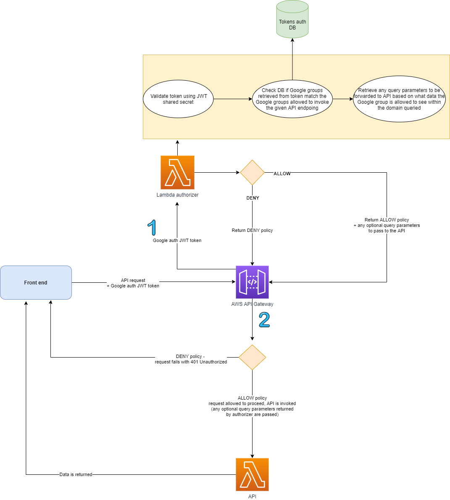

Within Hackney we currently use an API Authentication process to manage access to our APIs

### What is API Authentication?
Authentication involves verifying who is requesting access to your API

Authorization involves determining the degree of access that is available for the user. i.e. verifying what specific files, applications, data the user can access.

### How the API Authentication process works?




When a consumer makes a request to an API, the consumer provide their JWT access token in the authorization header of the request. Our custom lambda authorizer will take this token and will validate and decrypt it. The lambda authorizer will retrieve information about the token from the database and compare this data with the API request information which would be used on internal-facing Hackney services that also include their group information. The lambda authorizor is configured to map the API name along with the allowed Google groups for it. After the token is successfully validated and the data from it is read (email and Google groups the user belongs to), the Lambda function assumes the LBH_Api_Gateway_Allow_GET IAM role in the account, where the API is deployed. This is so the API ID received as part of the request can be mapped to the actual API name.

We would like to reuse the auth token set by the frontend authentication flow when users are signing in by passing it to a custom Lambda authorizer and using the information stored within the token for authentication purposes. The Lambda authorizer then queries DynamoDB to check if a record for the given API exists. If yes, the Google groups allowed to access the API are retrieved. The authorizer will then check what Google Group the client is in and verify if they’re in one of the allowed groups. Once the user/client has been authenticated, authorization can be handled at the API level to ensure the user/client has access to the requested resource. An AWS IAM policy statement is returned indicating whether the request was authorized or not, and then depending on the result either the requested Lambda resource is called or the client gets an unauthorized response.

Implementing authorization this way requires a bit more development work since this authorization layer introduces logic responsible for determining which parts/subsets/fields of data from a given data domain a user should have access to. For example, we envision that all notes recorded by multiple service areas will be saved within the same data store and served by the same microservice, but the microservice must have a mechanism to filter and return only data that a user should have access to

For example : If a user is a housing officer, they should not be able to see notes generated by social care. However, an advantage of this is that it removes the necessity to manage API keys in the infrastructure. Furthermore, this business is empowered to manage their own resources and determine who has access to them which gives them more flexibility.

### How to setup your API Authenticator?

Adding the authenticator to serverless
To add the Lambda Authorizer to serverless you would need to call it in the ```serverless.yml``` file:


The API authenticator arn must be included since it links to the api-authenticator lambda function which would require anyone calling the API to provide a JWT token that would only be accepted if the user is in any of the allowed Google Groups. The method type which is ”request” and the identity source is the method.request.header.authorization, which is where the tokens will be read from.


### How to Set Up the API Authenticator for your API
To allow a certain Google group to access an API:

1. Find the entry for your API and amend the ‘allowedGroups’ property
2. If an entry doesn’t exist, create one
3. Go to the respective API account, where the API authenticator is deployed
4. Go to DynamoDB
5. Open the ‘APIAuthenticatorData’ table and locate the record you wish to amend
6. Click on the record to edit and switch to ‘Text’ view


7. Amend the ‘allowedGroups’ list by adding/removing the name of the Google group

**Example scenario**:
1. User A is logged into the Manage a tenancy service and has opened a page to view details about a tenant, which includes a component that displays notes regarding the tenant.
2.The front end makes a request to ‘GET /api/v1/notes?personId=XXXXX’ and passes the auth token generated during Google auth step
3. The Lambda authorizer gets called, verifies the token and ensures that the user A is in a Google group that has access to the Notes API. If yes, it checks the field containing query parameters and includes them in the output of the function.
4. If access is allowed, the API gets called with the additional query parameters appended (e.g. excludeSource=socialCare )
5. The API retrieves all notes for the given tenant, apart from the ones with ‘source=SocialCare’ and returns the data
