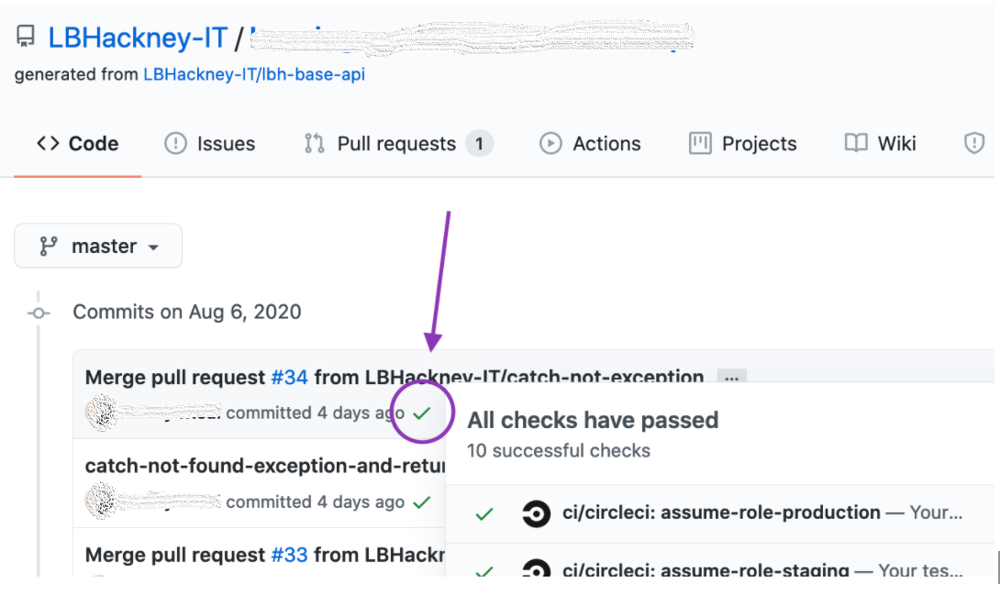
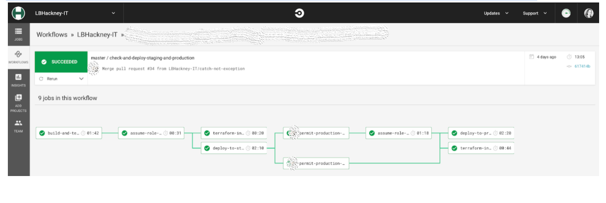
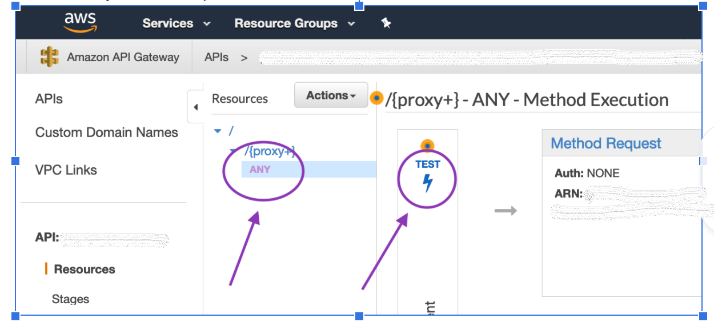

# Debugging APIs in Production
## Deployment:

1. Once your PR has been merged into master branch, head to the correct view in CircleCI - this is often easiest via clicking the check (or cross) symbol next to your merged PR in the GitHub repo’s list of master branch commits - use the “Details” links to go to the relevant CircleCI view:

;

2. Once in CircleCI, make sure you’re viewing the entire workflow for the build by checking the submenu on the left, and making sure the view URL includes workflows in its path.
   * i.e. https://app.circleci.com/pipelines/github/LBHackney-IT/person-api;

3. By navigating to the correct workflow, you can monitor the deployment of the application and manually permit the “Deploy to Staging” and “Deploy to Production” jobs if the prerequisite jobs (e.g. automated test runs, Terraform apply commands) succeed - or, if any jobs fail, you can click through to the job to debug the issue(s).

;

## Naming Conventions:

1. To review the endpoint URLs, check the controller(s) within your API project’s codebase for route statements like:

```c#
[Route("api/v1/persons")]
```

2. You’ll also want to check any expected query parameters, which you should find in one or more files with Param in the filename (e.g. `ResidentQueryParam.cs`);
3. If any of these route statements or query parameters seem incorrect in their names, including the casing, refer to the relevant Swagger documentation for the API and update the codebase (or the Swagger doc) as required;
4. If any route statements have been updated, be sure to double-check that they work and provide the expected responses, once the changes have been deployed to production, using the steps detailed in the ‘Responses’ section of this document;
5. There are also naming conventions to follow API Playbook link for responses;

## Responses

1. To test the API’s endpoints:

   * Visit the API Gateway dashboard within the correct region (e.g. https://eu-west-2.console.aws.amazon.com/apigateway/main/apis).
   * Select the API you’d like to test.
   * Click the “Any” resource option and then the “Test” button:
   
   * From the next view, you can choose a request method (such as GET), enter the path, set “stage variables” (like environment variables) and any request parameters, and then scroll down to click the “Test” button to see what the API’s response to your request is.
   * If the response is an error, you should be able to dig into the stack trace shown to begin debugging.

2. Make test requests of each of the API’s endpoints, looking for potential issues with:

   * Response structures
     * Do they match what you expect/the Swagger doc?
     * Are there any unexpected duplications?
     * Have enums been transformed correctly into strings?
     * Do all possible combinations of search parameters work as expected?
     * Do all possible variations of the limit and cursor parameters work as expected?

   * Response times
      * Are there requests that might take longer than the default lambda timeout of 6s to complete, e.g. searching all records with a high limit parameter?
      * Try to identify what kind of requests might trigger one or more long-running database queries - and see below for instructions for enabling slow query logging on any RDS database instances.

## Configuration and security:

1. Make sure slow query logging is enabled on any relevant RDS database instances by [steps to check or add to Terraform config?]
2. See the [Production Testing Checklist](/production_testing) to complete this section!

## Errors:
1. See the [Production Testing Checklist](../06-Testing/production_checklist.md) to complete this section!
