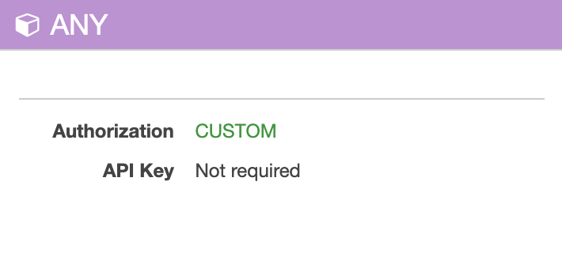

# Frequently Asked Questions

## How can I find Base URLs for APIs?:

You can do this by looking up the API in AWS API Gateway.
1. Go to the relevant [AWS Account](https://d-936715b9ec.awsapps.com/start#/) that the API is deployed to;
2. Choose "API Gateway" under "Services" in AWS;
3. Click on your API;
4. Click on "Stages";
5. Choose the stage you want to use;
6. Now you can see the entire URL inside a blue box on the top with the heading "Invoke URL";

## How do I find out whether an API is healthy?:

You can utilise AWS Canaries, which we use for uptime monitoring.
1. Go to the relevant [AWS Account](https://d-936715b9ec.awsapps.com/start#/) that the API is deployed to;
2. Choose “CloudWatch” under “Services” in AWS;
3. Click on “Synthetics Canaries” in the sidebar (under “Application Monitoring”);
4. This will list all of the canaries and their statuses;

To see more information about canaries and how to set them up, visit the relevant page [here](../DevOps practices/Monitoring/uptime_monitoring).

## Where do I find my token to use to authenticate access to APIs?:

1. Visit the [Hackney Authentication Service](https://auth.hackney.gov.uk/auth?redirect_uri=https://auth.hackney.gov.uk/auth/check_token) website to check your Hackney JWT token. You may need to log in during this;
2. Inspect your cookies to find the `hackneyToken` cookie. This will depend on your browser. See [here](https://cookie-script.com/documentation/how-to-check-cookies-on-chrome-and-firefox) for instructions on how to find cookies on Google Chrome or Firefox;
3. Add this token value to the `Authorization` header in all API requests. This will allow you to authenticate access to Hackney APIs;

## How do I find the authentication process used for an API?:

You can do this by looking up the API in AWS API Gateway.
1. Go to the relevant [AWS Account](https://d-936715b9ec.awsapps.com/start#/) that the API is deployed to;
2. Choose "API Gateway" under "Services" in AWS;
3. Click on your API;
4. Click on "Resources" and select  **`/{proxy+}`**. This is the API endpoint;
5. This will bring up a box that looks like this:
    
    - If it says `Authorization: Custom`, that means this API uses a lambda authoriser;
    - If it says `API Key: Required`, this means that this API uses an API key;

## Where do I find the API Key value from?:

This can be found through API Gateway.
1. Go to the relevant [AWS Account](https://d-936715b9ec.awsapps.com/start#/) that the API is deployed to;
2. Choose "API Gateway" under "Services" in AWS;
3. Choose “API Keys” from the sidebar;
4. This will bring up a list of API Keys. Choose the relevant API Key, select the blue ‘Show’ link, and you will see the API Key value;

## How can I access our CircleCI Pipelines?:

Visit [https://app.circleci.com/pipelines/github/LBHackney-IT](https://app.circleci.com/pipelines/github/LBHackney-IT) to view workflows from projects you follow at Hackney.

If you aren't subscribed to any projects, simply navigate to the'projects' tab on the sidebar to view and search for all Hackney projects.

