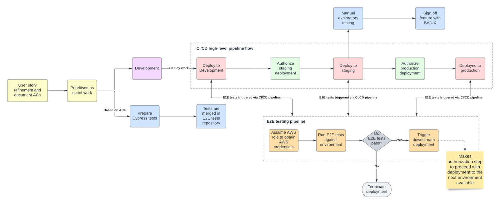

### Context
This document aims at outlining what are the minimum testing and quality assurance processes that should be done for each project as part of the Software Development Lifecycle.

Each product will be asked to demonstrate sufficient testing performed as per the minimum testing activities described in this document. 

[HackIT Testing Standards](./testing_standards.md)

### APIs and Backend services
Process diagram:
Click image to open in a new tab. 

All APIs and Backend services must be built following the test driven development approach, as described in our [API Playbook](https://playbook.hackney.gov.uk/API-Playbook/tdd).

**Tests written by:** Software engineers
**Tests executed by:** Software engineers (as part of local testing) and CI/CD pipeline, as part of Continuous Integration

**Code testing**
- [Unit testing for all components that make an API](https://playbook.hackney.gov.uk/API-Playbook/unit_testing)
- [Integration testing using Docker and localstack for provisioning local AWS resources to run the tests against.](https://playbook.hackney.gov.uk/API-Playbook/integration_tests)
- Contact testing using a PACT broker (TBC)

**Other automated testing**
- [Vulnerability scanning using SonarCloud](https://playbook.hackney.gov.uk/API-Playbook/sonarcloud)
- [Terraform-compliance checks](https://playbook.hackney.gov.uk/API-Playbook/terraform_compliance)

### Frontend services
Process diagram:
Click image to open in a new tab. 

All Frontend services must have corresponding unit tests implemented as part of a Test Driven Development approach. 

**Tests written by:** Software engineers
**Tests executed by:** Software engineers (as part of local testing) and CI/CD pipeline, as part of Continuous Integration

**Code testing**
- Unit testing

**Other automated tests**
- [Vulnerability scanning using SonarCloud](https://playbook.hackney.gov.uk/API-Playbook/sonarcloud)
- Contract testing using a PACT broker (TBC)

### Product testing
Process diagram:
Click image to open in a new tab. 

All products must implement E2E testing, using tools such as Cypress, to validate that features are correctly implemented and the frontend and backend are successfully integrated. This step is crucial for the continuous delivery phase.

**Tests written by:** QA engineers
**Tests executed by:** QA engineers (as part of local testing) and CI/CD pipeline, as part of Continuous Integration

- [E2E automated tests using Cypress (or similar)](https://playbook.hackney.gov.uk/micro-frontends/testing/)
    - Run everytime a deployment occurs against an environment
- [Manual exploratory testing](https://docs.google.com/document/d/1R7JEXdbjhAESbO5JAp7kvlrxxY19MOxBhpwOQ1pdUpQ/edit?usp=sharing)
- [Accessibility testing](https://playbook.hackney.gov.uk/API-Playbook/accessibility_testing)

