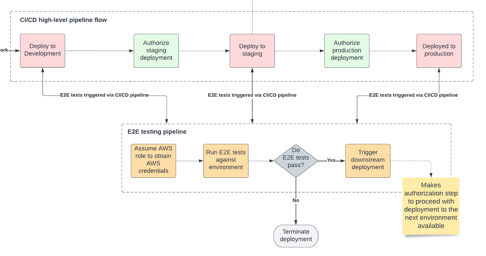

### Cypress end-to-end testing

At Hackney, we always strive to deliver high quality digital services to our residents. To achieve that, we continuously review and seek to improve our development processes and practices. 

Our API development is already enhanced by strong processes such as test driven development and API integration testing. 

A new change in our processes is the quality assurance end-to-end testing using Cypress we have introduced as part of our software delivery lifecycle. 

## Current QA process
- User stories are refined with clearly defined acceptance criteria
- Cypress end-to-end tests are written to reflect the acceptance criteria
- The end-to-end tests are run after each deployment to an environment, making continuous delivery only available if the tests have successfully run against the current environment.
- Manual exploratory testing is performed on our Staging environments

Click image to open in a new tab. 
[](./docs-images/qa_process.png)

## Writing Cypress tests - the components
### Acceptance Criteria
These are written using the Gherkin syntax which is a language utilised by the Cucumber test plugin. These are generally agreed with the rest of the development team and/or business stakeholder during refinement or planning sessions. They are written in a *Given, When, Then* format and represent a sequential flow of actions that should be performed. It is not necessary to follow the exact format as presented as part of the ACs, but rather use it as a guide from which to gain confidence that the correct amount of coverage around the feature(s) has been achieved.

### Feature files
These are physical files that contain the acceptance criteria as discussed above. In general, they should be written to match the acceptance criteria, although this is not always possible due to concurrency of the actions being performed.
- Make use of background steps to create testing state
- Reuse existing features where possible
- Leverage feature tags and data tables to allow for flexible test scenarios that can be parameterised or data driven.
Written in this way, the feature files effectively become the living documentation of the application, so we are able to infer not only the thing we are testing but also the expected behaviour.


### Page objects
We utilise the page object pattern to create a set of reusable page elements that we can then call within our steps file. They also may take environment context from an environment config file.
- Each view should be mapped within separate classes. Components that are shared across multiple views (such as page headers) should have a single page object file.
- Make use of robust selectors - prioritising the use of button text. If necessary update the front end code to provide this more effectively (via use of “data-testid”) and avoid hard coding transient selectors (for instance for table elements of an unknown length etc.)
- Only map elements that you will actually use as part of a test
- Limit the abstraction of sequential and/or ‘bundled’ actions as part of the page objects file itself. If necessary, create a separate ‘actions’ class relating to the page object which contains all of the performable actions that can be called by the steps file

### Steps files
These are effectively the implementation of our tests, calling on the features and page objects to create our runnable test cases and generally follow the principles already outlined as part of the testing approach in our [API playbook](https://playbook.hackney.gov.uk/API-Playbook/tdd).


## Automating tests runs
Our tests are triggered automatically after each deployment to a development, staging or production environment.

To achieve that, we configured our CI/CD pipeline to invoke a separate, independent end-to-end testing pipeline at the end of each environment deployment. 

Any subsequent deployments depend on whether tests have successfully run against a given environment as the staging and production deployment pipelines only become available if the end-to-end tests have passed. 

Benefits to this process:
- No deployment to a staging or production environment unless tests are passing.
- No way to manually bypass the tests and proceed with deployment unless a PR is raised and approved.
- No dependency on a QA engineer to manually run tests against each environment.

The deployment flow goes as described below:
- Frontend code gets deployed to development
- CircleCI (our tool of choice for implementing our CI/CD pipeline, however, any other tool can be used to replicate this flow) triggers the end-to-end project’s pipeline as the last step of the deployment process. 
- The end-to-end tests get run. 
- If all tests have successfully passed, the end-to-end project’s pipeline triggers a downstream deployment - = it enables the target project’s pipeline to deploy to staging.
- Once the staging pipeline is available, engineers manually authorise the deployment to proceed.
- At the end of the staging deployment, the same testing process repeats and the production deployment pipeline only becomes available if the tests are successfully run against the staging environment.

Click image to open in a new tab. 
[](./docs-images/high_level_flow.png)

This was implemented with the use of CircleCI’s API. 

```yml
steps:
          - run:
              name: trigger downstream deployment for <<pipeline.parameters.upstream_pipeline_name>>
              command: |
                        export UPSTREAM_PIPELINE="$(echo << pipeline.parameters.upstream_pipeline_name >> | sed 's,https://github.com/,,g')"
                        export DEPLOYMENT_ENVIRONMENT='run_<< parameters.stage >>_workflow' ;
                        curl --location --request POST 'https://circleci.com/api/v2/project/gh/'"$UPSTREAM_PIPELINE"'/pipeline' \
                        --header 'Circle-Token: '"$CIRCLE_TOKEN"'' \
                        --header 'Content-Type: application/json' \
                        --data '{ "branch": "main", "parameters": { "run_development_workflow": false, '\""$DEPLOYMENT_ENVIRONMENT"\"': true } }' ;
```
## Manual QA testing
QA engineers are still able to run their Cypress tests suite manually - this is particularly useful for running smoke tests against a production environment or tests of an individual feature only. 

This has been achieved through the use of tags - our tests and feature files include tags, which group tests (for example accessibility tests) and give the engineers the flexibility to cherry pick what tests to run.

### Manual exploratory testing
Another important part of our quality assurance process is performing manual exploratory testing - manually testing the system in the capacity of an end user.

Although end-to-end test automation is a great way to raise the confidence in a deployment and to check for bugs, manual exploratory testing can help uncover issues that could have been missed by the tests use cases.

## Conclusion
Centralising our Cypress tests in a single repository, although they cover functionality delivered by multiple micro-frontends, stored in separate repositories, has helped us streamline and speed up the work of our QA engineers. Embedding the centralised tests into the deployment process of each individual frontend pipeline has removed the need to manually trigger tests and has provided additional assurance that deployments to staging and production environments would only happen if end-to-end tests are successfully passing. 

We always strive to continuously improve our processes, so we didn’t stop here. Some other improvements to our assurance processes include introducing vulnerability and secrets scanning, infrastructure compliance testing and contract testing. We will be sharing more details about those soon.


