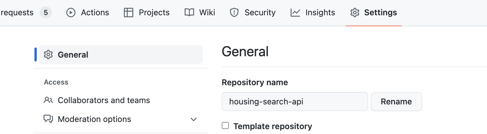
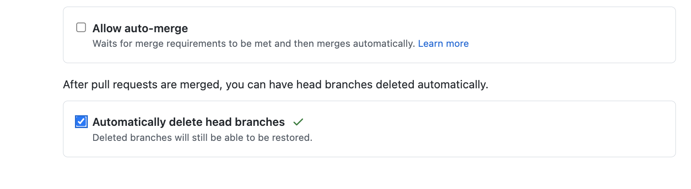

### Stale branches

**What are stale branches?**

Branches that have not had any commits in the last 3 months. Those are usually the result of:
- Feature branches, which were never merged and released.
- Branches used for Proof Of Concepts (POCs) and spikes.
- Incomplete work.

**What is the problem with stale branches?**

Keeping stale branches might result in a large list of available branches in a repository, making it difficult to identify branches, which contain relevant, on-going work. 

**How to deal with stale branches?**

Developers should periodically check and delete any branches that are no longer needed to their respective projects. It is the responsibility of the engineers contributing to a repository to ensure that the branches they create are removed when no longer needed.

### Automating deletion of merged branches
To reduce the number of redundant branches, all repositories must have the automated deletion option enabled for branches, which are merged into a main branch.

Once deleted, the branches can be restored at a later stage if needed.

To enable automated deletion of branches, go to the repository’s ‘Settings’ page.

Under “General”, navigate to the ‘Pull requests’ section and select the ‘Automatically delete head branches’ option.
 

