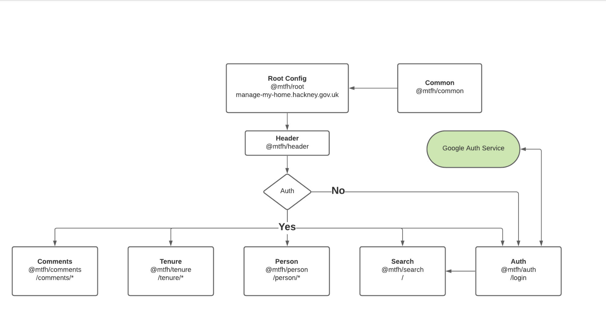

## Independent Teams
Microfrontends allow teams to work independantly with their own codebases, pipelines and release strategies to contribute to the same application. This leads to faster development, less dependencies and less domain knowledge required to start contributing effectively.

## Isolated Environments
Each MFE can have their own supporting architecture completley isolated from other parts of the ecosystem. If one MFE fails to build/deploy the rest of the ecosystem is unaffected. You also only need the MFE's you are working on during development, reducing complex getting started guides.

## Scalabale Focussed Teams
Focussed teams can be built around a single MFE allowing the org to scale independantly with considerably reduced onboarding efforts. Allowing domain expert developers to work on features autonomously.

## Maintainable
MFE's are in general much smaller applications to their monolith counterparts. Allowing developers to understand the entirety of the app with less overhead. Resulting in better long term maintainence.

## Example of usage

