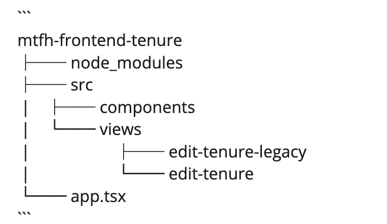

The Configuration Api provides an endpoint for collecting feature toggles defined in the Github repo:
 [configuration-api-files](https://github.com/LBHackney-IT/configuration-api-files).

We primarily use Feature Toggles as a release mechanism to support continuous delivery as well as timed releases.

## Adding a new feature toggle

To add a new feature toggle, create a PR in the `configuration-api-files` in the main file that relates to your project/team, in each environment directory.

NB: As a general rule of thumb, it's good to enable to feature toggle for `development` initially, while having it off for the others until you need to toggle.

In the [`@mtfh/common/lib/configuration`](https://github.com/LBHackney-IT/mtfh-frontend-common/blob/main/lib/configuration/configuration.ts) you will need to define the scope, as well as the feature toggles the frontend needs to support.

        ```tsx
        const initialFeatureToggles = {
          MMH: {
            Test: false,
            TenureActivityHistory: false,
            RefactorComments: false,
            CreateTenure: false,
            EditTenure: false,
          },
        };
        ```
This step allows us to enforce feature toggle names in our UI.

## Using a feature toggle

In React, we provide a hook to access feature toggles within React components:
          ```tsx
          import { useFeatureToggle } from '@mtfh/common/lib/hooks'

          const View = () => {
          	const hasEditTenure = useFeatureToggle('MMH.EditTenure');
          }
          ```
** Outside of React: **

          ```tsx
          import { hasToggle } from '@mtfh/common/lib/configuration'

          const hasEditTenure = hasToggle('MMH.EditTenure')
          ```
## Released Deployments

Our micro-frontends are setup for continuous delivery through trunk based git flow, and as a result all unreleased features that introduce change should be feature toggled. This is so developers can continuously work on features and still allow hot fixes.

A helpful strategy to reduce complexity and avoid deeply nested feature toggles, we recommend duplicating the top level views and marking the current version as legacy.



** In app.tsx: **

        ```tsx
        import { useFeatureToggle } from '@mtfh/common/lib/hooks';
        import { EditTenureViewV2, EditTenureView } from './views';

        export default function App(): JSX.Element {
          const hasEditTenureV2 = useFeatureToggle('MMH.EditTenureV2');

          return (
            <Switch>
              <Route path="/tenure/:tenureId/edit">
                {hasEditTenureV2 ? <EditTenureView /> : <EditTenureViewLegacy />}
              </Route>
            </Switch>
          )
        }
        ```
