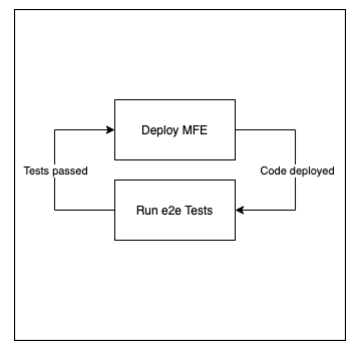
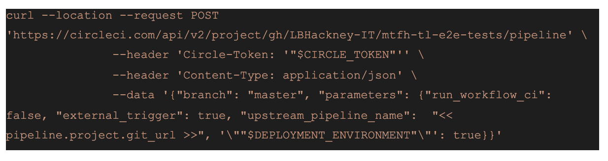
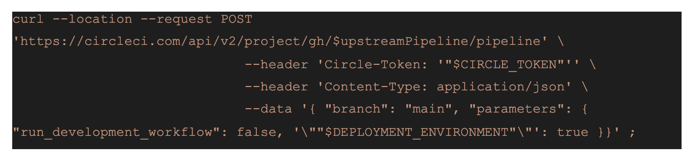
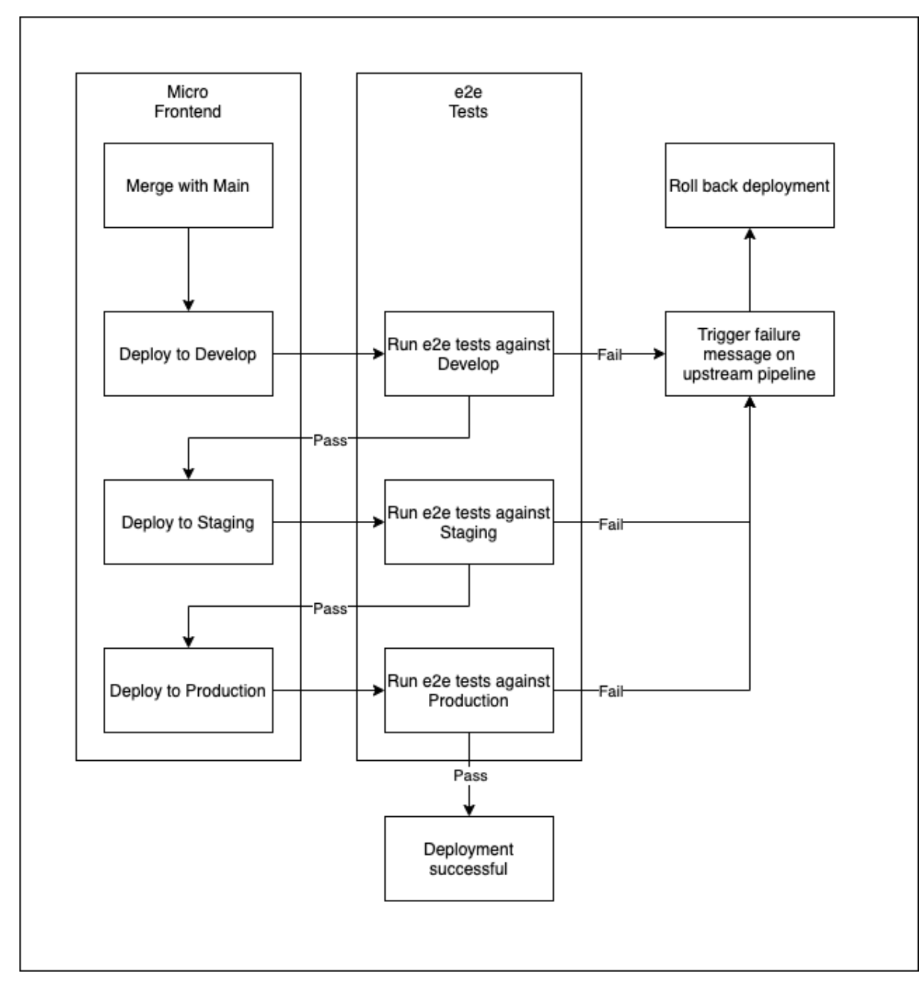

## Micro frontend quality gates

We use a recurring pipeline ‘pattern’ to trigger the deployment and testing of the micro front ends.
Each independent micro front end targets a single repository that contains a suite of end-to-end tests.

Once a micro front end has been deployed to its first environment (development), it triggers the end-to-end tests which target the same environment that was deployed (this can be either the entire suite of tests or a subset as desired), once these tests have ran, then it will trigger the ‘parent’ mfe pipeline again.

If the tests fail then it will halt deployment and roll back the changes. If all tests pass then the parent pipeline will deploy to the next environment (staging) and the deployment and testing cycle continues until either a failure occurs or the application is deployed and tested in production.

On the mfe side, there is some boilerplate code within the CircleCI config.yml file that makes an API call to the e2e pipeline

Similarly, here is the response from the e2e tests if a successful workflow occurs

The notion of having a single repo that holds all of the system tests is to enable complete user journeys that span across multiple micro frontends. They are not designed to work in lieu of component and integration tests that each micro frontend should be providing, but rather offer coverage that compliments these tests, as well as extending them to providing actual ‘real-world’ journeys that the end users would perform.

It’s important to note that a more ‘robust’ approach to this sort of test automation would be the ability to run the tests without any deployments being made to a physical environment. As it currently stands, the e2e tests are beholden to the state of the environments being actively maintained and so may result in situations whereby a mfe pipeline becomes blocked due to issues unrelated to the code changes made to the mfe if the target environment isn’t in a fully working state. We acknowledge that creating an ephemeral environment for the entire MMH application would present a considerable challenge and consume a lot of development time however.

** Diagram of MMH MFE test flow **

