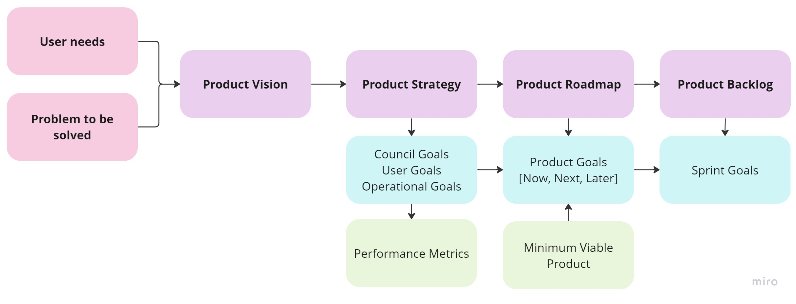
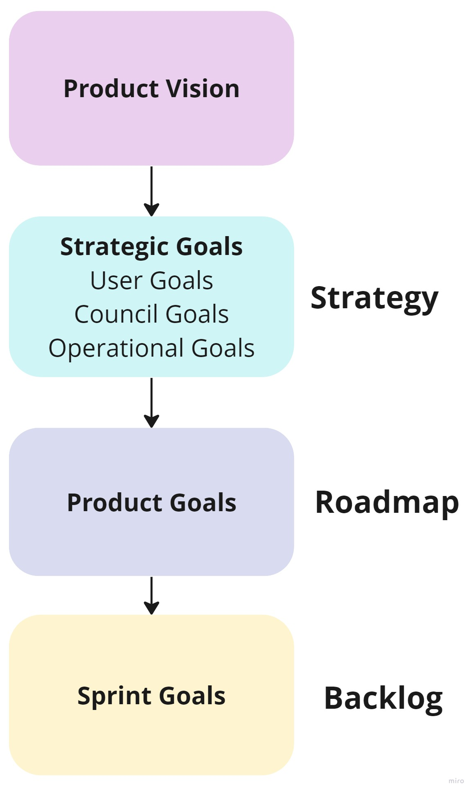

# How we work
## Introduction

At Hackney, we design and deliver products in a consistent but adaptable way. Structure will help us scale up, but we don’t produce documents for documents’ sake.

We work to [GDS service standards](https://www.gov.uk/service-manual/service-standard) and put resident’s needs at the heart of what we deliver. We strive to use industry best practice for product management and take pride in our profession.

## Product inception

- Each product should start with a clear problem to solve for a defined user group, within those who live and work in Hackney.
- High-level user needs should be identified through data, insight and research and these should inform the product direction.
- We will be solution-agnostic and focus on solving residents’ problems in the most effective way.
- We should only start a project when the conditions are right (defined in [Hackney Council Product Strategy 22-23](hackney-council-product-strategy.md)).

## Product artefacts

- Researched user needs and data should inform all our product artefacts.
- Our products should bring value to Hackney Council and our residents. We will show this through a strategic thread of goals that link back to the [Hackney Council Manifesto](https://www.hackney-labour.org.uk/hackney-labour-2022-26-manifesto/), the Strategic Plan and our user needs.
- We believe that a meaningful product vision, strategy, roadmap and backlog (which we call product artefacts) will help us focus on building the right thing for our users.
- If we don’t have the information we need or the processes to produce these artefacts it's better to not have them rather than invent something not grounded in research.

The consistent goals and artefacts we would like available for each product can be seen below:

We intend to create a strategic thread of goals that join our day-to-day tasks back to our user needs and Hackney’s manifesto aims:

For support and resources to create these elements, please see the individual guidance in this chapter of the playbook.

## Where to start
- Start with gathering your [user needs](user-needs.md) of your residents, this can be using existing or new research, data and insight
- Clearly identify the problem to be solved
- Create a [product vision](product-vision.md)

