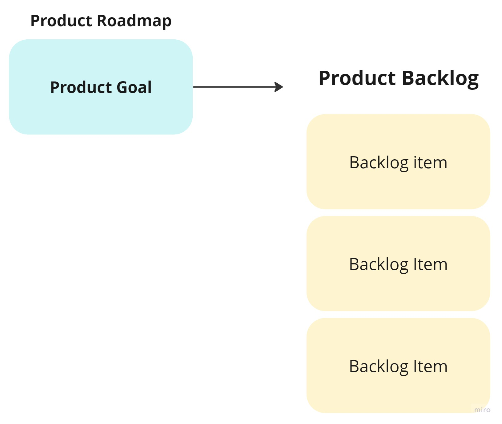
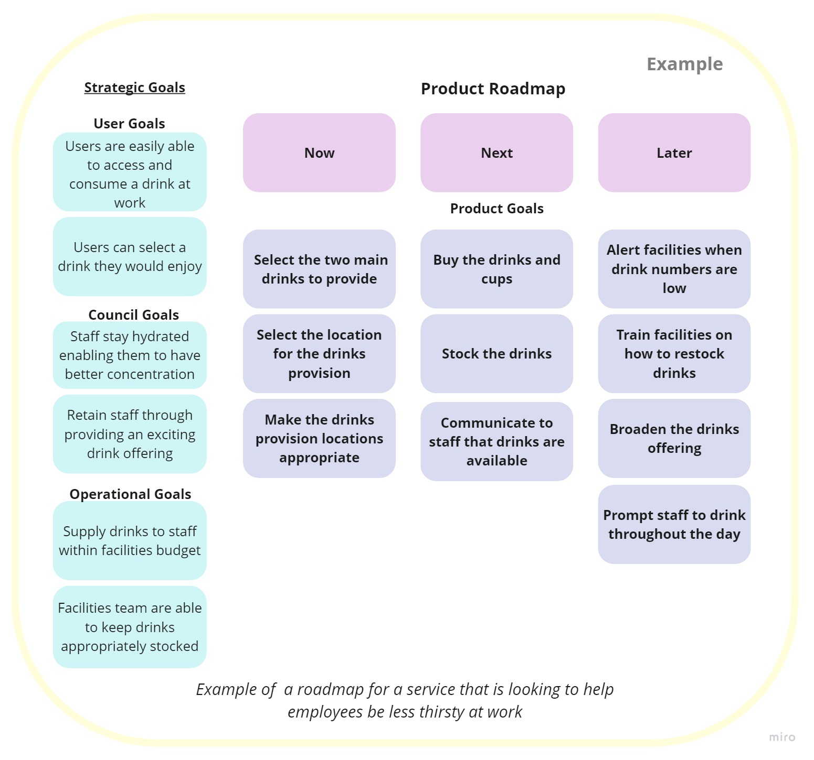
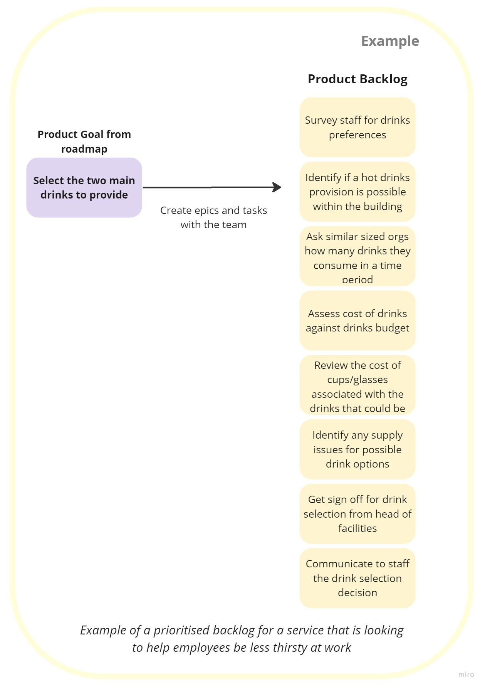
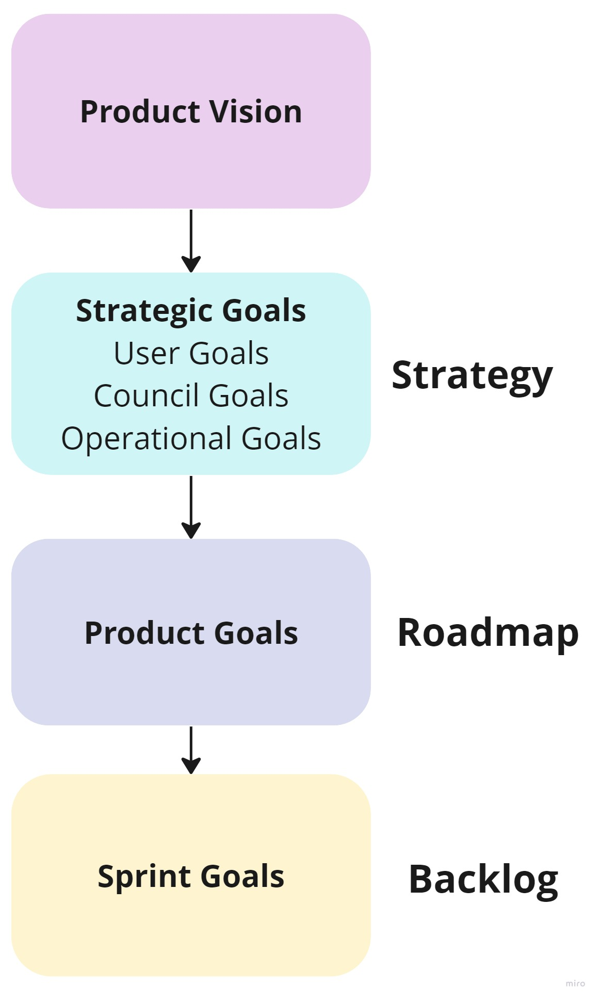

# Product Backlog
## Introduction

The product backlog is a prioritised list of what needs to be done to build or improve the product.

## Creating the backlog

- The product backlog needs to be derived from the product roadmap.
- The backlog should comprise the tasks needed to be done to achieve the product goals in the ‘now’ section of the roadmap.
- It can be helpful to focus on one product goal at a time from your roadmap. This keeps the backlog concise and focused.
- The product backlog is a tactical tool that can contain user stories, designs, sketches, mock ups, user journeys etc.
- It should be concise and focused, rather than becoming a ‘wish list’ of lots of items.

## Backlog Example

To better understand how we would build a backlog from our roadmap here is an example.  This is an example of a roadmap for an organisation with the vision ‘A workplace where no employee goes thirsty’.

The team would then use the goals in the ‘Now column’ and create the backlog from these goals.

Here is an example of their initial backlog from the first item in their roadmap ‘Select the two main drink providers’:

Breaking down the backlog tasks specific to the first product goal of the roadmap ensures that their work is focused on what is most important. It also enables small achievable tasks to still map back to the bigger aim of achieving their product strategy and vision.

## Prioritising the backlog

- Prioritise the items that you have more certainty about, to achieve the product goal with the least amount of effort.
- Data and research should be used to identify items that would most likely achieve the product goal. The product team can then identify and inform the level of effort.
- It is important for product managers to say ‘no’ to backlog items that do not contribute to the product goal and therefore wouldn’t help meet the product strategy and vision.
- It can also be important to identify higher risk items that might need to be worked on sooner.

## Refining the backlog

- High priority items should be at the top of the backlog, and be in a detailed ‘ready’ state.
‘Ready’ items are clear and understood by the team, testable with acceptance criteria and be small/not too complicated so that they can be completed in the sprint.
- Items lower down the backlog are lower priority and should be in a bigger ‘sketchy’ state.
- The product team should contribute to refining and prioritising the backlog and using their specialist knowledge to inform on activities, dependencies and risks to inform backlog items.
- The product backlog should change over time, especially as data, insight and user research is reviewed. This should influence the creation of new items and the removal of less relevant tasks.

## Sprint Goals

We intend to create a strategic thread of goals that join our day-to-day tasks back to our user needs and Hackney’s manifesto aims:

- The sprint goal is the purpose for the team for the sprint (or next agreed period of time) and communicates the ‘why’ behind the work.
- It is what the team intends to achieve when the backlog tasks are completed.
- A sprint goal might be to deliver a feature, address a risk or test an assumption and will link back to a product goal in the roadmap.
- It should identify what needs to be achieved and how we know it is done.
- The sprint goal should be agreed between the product manager and the product team and communicate what is achievable for the team.
- Daily stand ups should feedback on how work is contributing to achieving the sprint goal and help the team stay focused.

## Further Information
- [Scrum.org - 11 Advantages of Using a Sprint Goal](https://www.scrum.org/resources/blog/11-advantages-using-sprint-goal)
- [Scrum Alliance - Sprint Goals Provide Purpose](https://resources.scrumalliance.org/Article/sprint-goals-provide-purpose)
