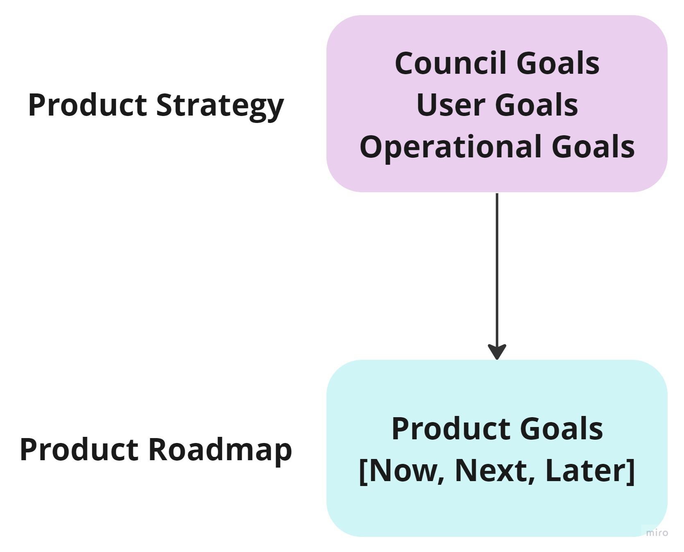
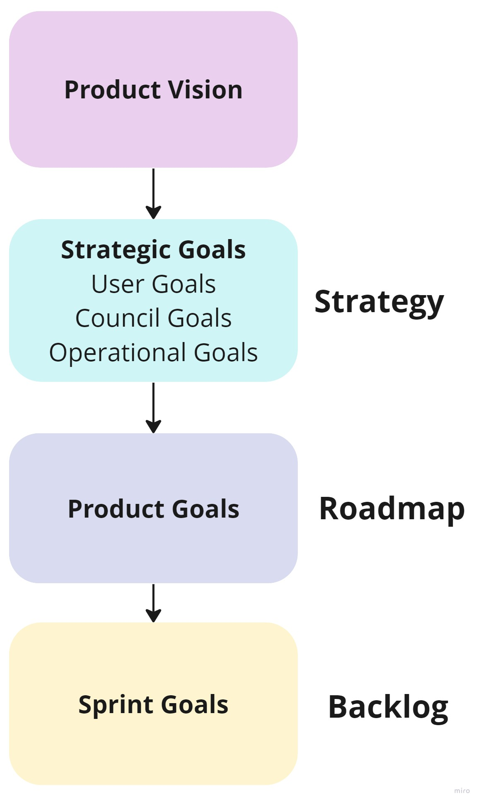
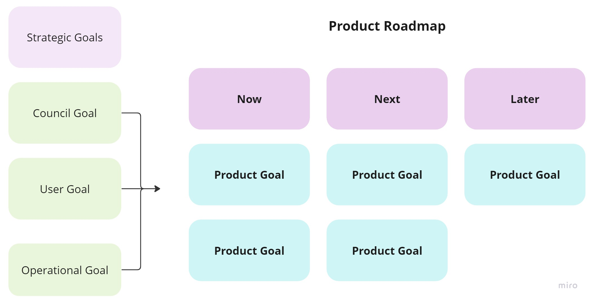
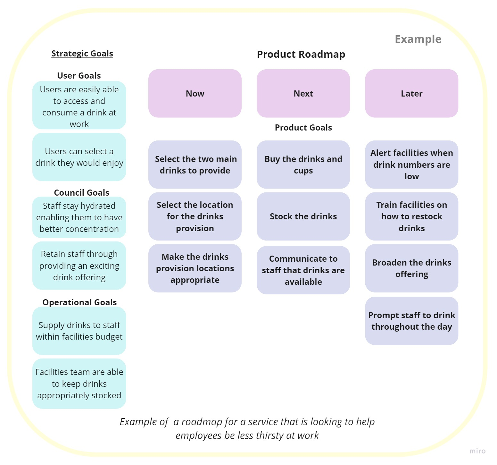
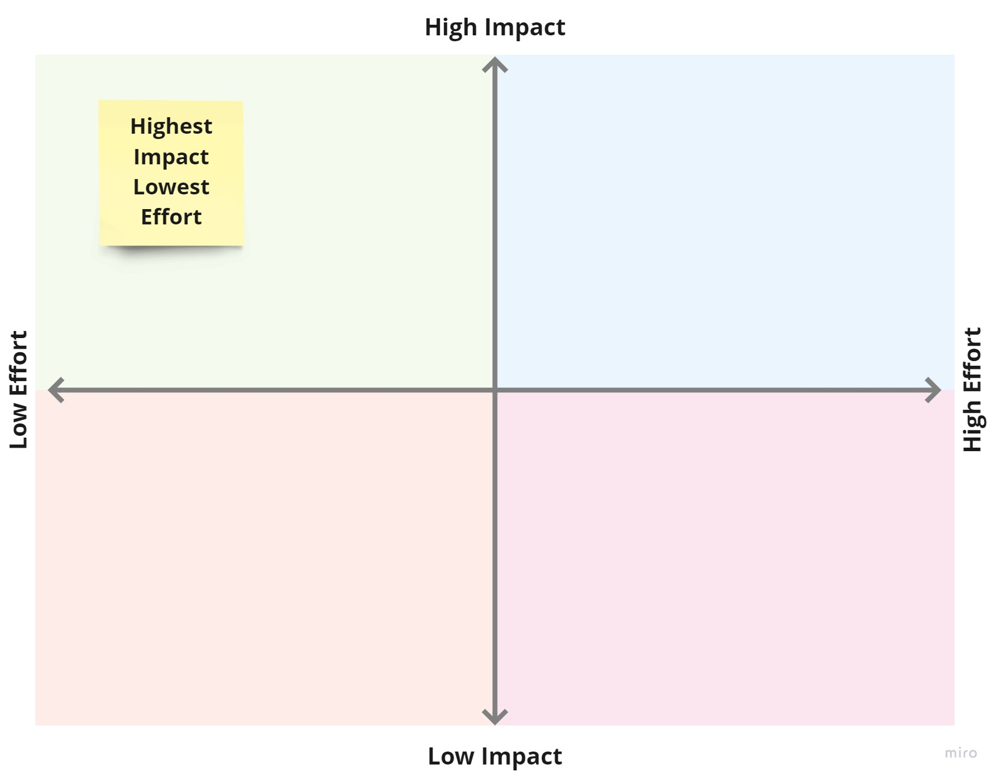

# Product Roadmap

## Introduction

- ‘A roadmap is a plan that shows how a product or service is likely to develop over time’ (GDS Service manual).
- Our roadmaps will use a Now, Next, Later format - with the time periods for each defined by the product team.
- The roadmap is intended to be flexible and change to suit changing circumstances or be reprioritised as product teams learn more from data, research and feedback.

<u>Product Goals</u>

- The roadmap will be formed of the goals that we would like our product to achieve.
- Product goals describe the desired future state of the product, and the benefit the product should bring to our users.
- These will map to the Council, User and Operational goals in our product strategy.
- Product goals will be larger in size than an epic or task in the backlog, but smaller than our strategic goals.
- Each product goal can contain high level features/deliverables to meet the goal and relevant metrics to identify if the features built do achieve the overall product aims.

We intend to create a strategic thread of goals that join our day-to-day tasks back to our user needs and Hackney’s manifesto aims:

<u>Creating the roadmap</u>

- Creating and prioritising a roadmap should be led by the product manager.
- It should be a collaborative process involving the product team and key stakeholders.
- Roadmaps need to be informed by data, performance analytics and user research.
- Initially a product roadmap may consist of the goals that would need to be achieved to create the minimum viable product.
- It can also be helpful to consider the following areas when creating a roadmap: new ideas, product iterations, user issues/feedback, features to scale and ways to improve the quality of your product.
- Product goals should be able to map back to the Council, User or Operational goals in your strategy, and one product goal can often be mapped back to multiple strategic goals.

## Roadmap Example

To better understand how we would build a roadmap from our product strategy here is an example.  This is an example of a roadmap for an organisation with the vision ‘A workplace where no employee goes thirsty’:

Each product goal in this example roadmap can map back to multiple strategic goals.The product goals in the roadmap are smaller and easier to achieve in size than the strategic goals. For example the item in the roadmap “Buy the drinks and cups’ is an achievable step towards the bigger goal of “Users are easily able to access and consume a drink at work’.

## Roadmap Ideas

- Use the ‘new idea canvas’ to start considering the validity of your ideas for the roadmap, ensuring that they are backed by research and data.
- If a number of the fields in the canvas are blank or do not support creating value for your users, you could consider generating further ideas or carrying out additional research.
- It is important to review the selected product ideas to see if they can be made less complex or more achievable. Often a goal can be refined to be more focused but still achieve the vision and bring benefits to users.
- Use the idea refinement canvas to see if goals can be made smaller or more focused.

## Prioritising the roadmap

- Prioritise your roadmap into now, next and later. The product team can decide the rough time period these relate to.
- Once ideas have been validated and refined, mapping the effort vs impact of each idea with the product team is a good exercise to start identifying priorities.
- Effort should be quantified by specialists in the product team, particularly those who have experience with quantifying the time and energy required for delivering technology.
- Impact should be quantified using evidence from research, data and insight. This should help avoid assumptions or pre-existing ideas for solutions.
- It is important to flag any dependencies within your team and from other teams or services and sequence your roadmap accordingly, collaborating with a Delivery Manager on sequencing is important.

## Further Information
- [New idea canvas](https://miro.com/app/board/uXjVPpbQeSQ=/?share_link_id=600539960503)
- [Idea refinement canvas](https://miro.com/app/board/uXjVPpbQeSQ=/?share_link_id=600539960503)
- [GDS Service Manual - Developing a Roadmap](https://www.gov.uk/service-manual/agile-delivery/developing-a-roadmap)
- [Roman Pichler - Product Goals in Scrum](https://www.romanpichler.com/blog/product-goals-in-scrum/)
- [Intercom - Where do product roadmaps come from?](https://www.intercom.com/blog/where-do-product-roadmaps-come-from/)
- [Working with Agile Product Roadmaps](https://www.romanpichler.com/blog/agile-product-roadmap/)
- [A suitably detailed roadmap](https://cutlefish.substack.com/p/tbm-41b52-suitably-detailed-roadmap?s=w)
