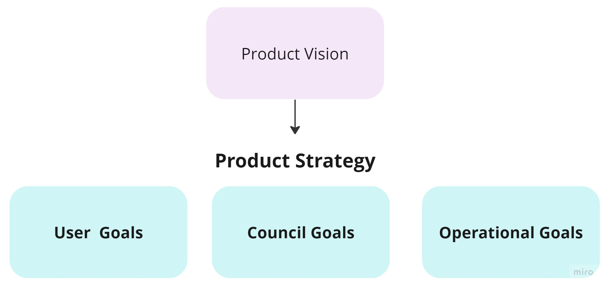
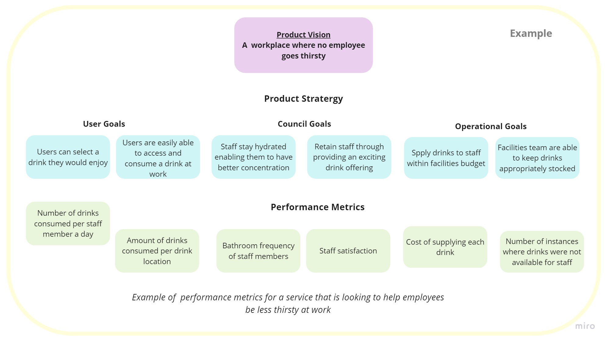
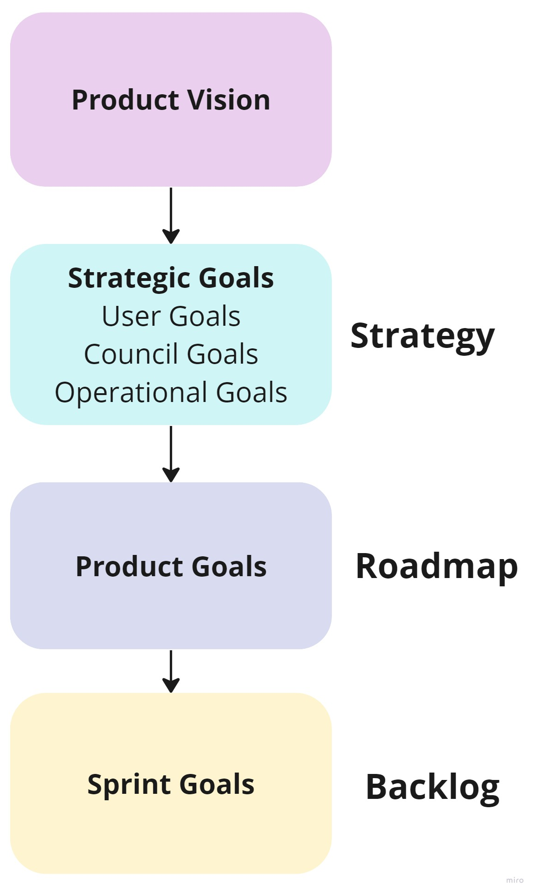
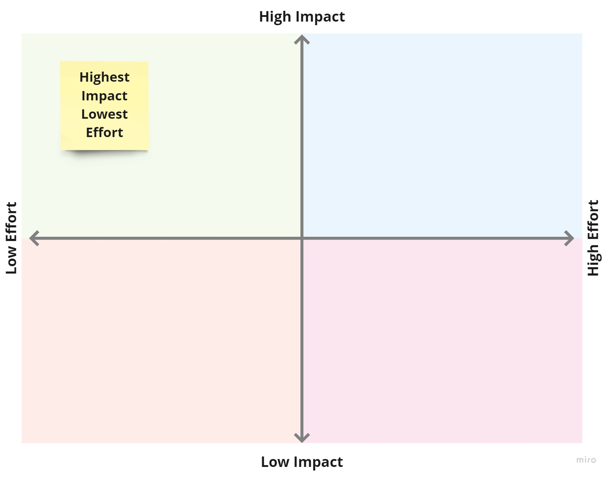
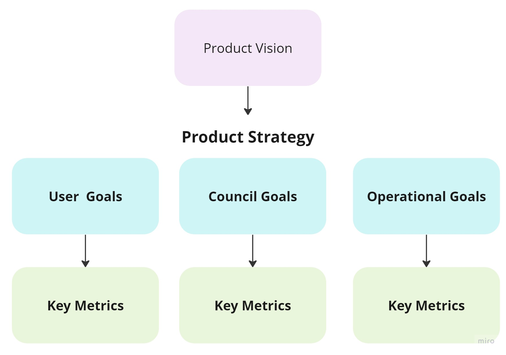
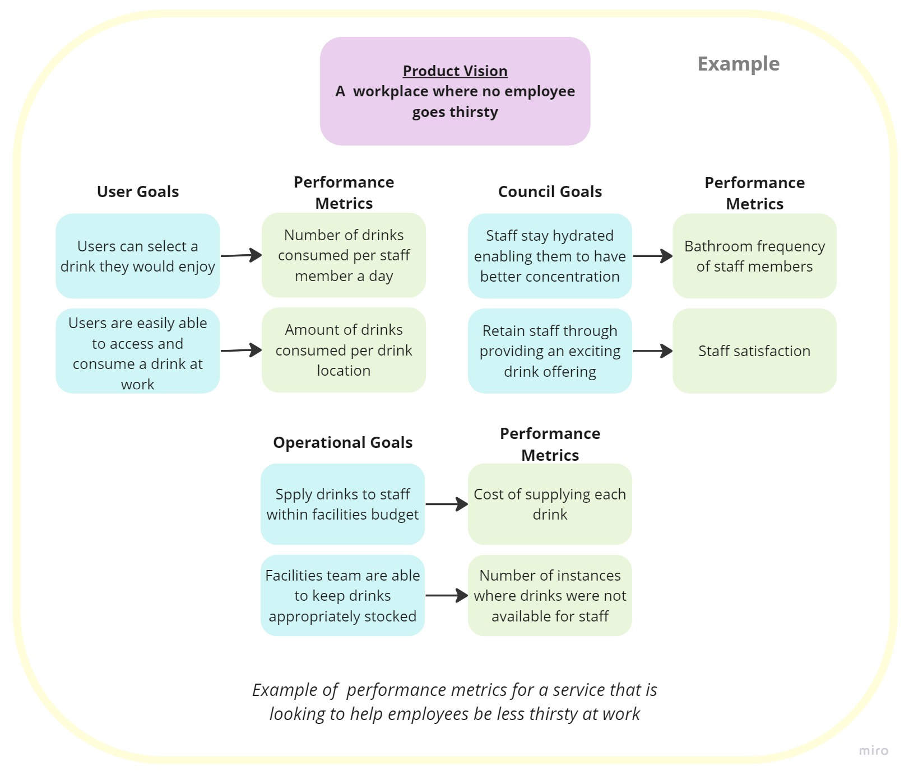

# Product Strategy
## Introduction

- The product strategy is the proposed approach to how we intend to reach our vision.
- It is a set of hypotheses that are being prioritised for how we will create value for our residents and Hackney Council.
- The strategy is for a set period of time, defined by the product team (roughly 6-12 months) and will be updated over time as we learn more through user research, data and user feedback.
- At Hackney our approach to creating a product strategy is to use strategic goals that consist of user goals, operational goals and Hackney Council goals.
- Strategic goals should be high-level, achievable and measurable.

## Product Strategy Example

To better understand the aim of a product strategy here is an example. The example shows a product strategy that aims to fulfil the vision of an organisation where no employee goes thirsty.

This example shows the goals that the team believes will best achieve their vision. These goals for the product are categorised into user goals, council coals and operational goals and show the different motivations behind the vision. If these goals are achieved the team hypothesises that their vision will be closer to being reached.

## Strategic Goals Explained
## User Goals

- Each product should have two User Goals
- User Goals should focus on our residents, those who live and work in Hackney
- These should be short statements about what we want to achieve for our users and what would make it a successful product for them
- These goals will be our prioritised approach for achieving our vision for our users for the next period of time

## Hackney Council Goals

- Hackney Council Goals should be short statements relating to how our product will help support the Council Manifesto and strategic plan.
- They will take a strategic approach to creating missional and political value from our products.
- The two goals we would like products to address are:
  1. How the product will create value for money for our residents, through improving efficiency, flexibility and performance.
  2. How the product will support a a fairer, safer, greener, healthier Hackney.

## Operational Goals

- It might be relevant to name operational service goals for the product (no more than two).
- Often our products will create value to internal staff and colleagues, these goals will state how this product would be a successful product for our services.
- It is important for us to be pragmatic in balancing these goals with our user goals so that they are not in conflict and find a collaborative solution.

We intend to create a strategic thread of goals for our products that join our day-to-day tasks back to our user needs and Hackney’s manifesto aims:

## Which Goals to Prioritise?

- The product manager is ultimately responsible for deciding which goals to prioritise.
- It is important to use your user needs and problem statement along with user research, data and market analysis to identify approaches and evidence how they might achieve the vision.
- Use Hackney’s [‘New Idea Canvas’](https://miro.com/app/board/uXjVPpbQeSQ=/?share_link_id=600539960503) to start mapping out the validity of your potential goals.
- If a number of the fields in the New Idea Canvas are blank or do not support creating value for your users, it could be worth generating further ideas or carrying out additional research.
- Use your vision, user needs and problem statements to challenge each goal idea to ensure they really are focused on creating benefits for our users.
- It is important to review selected goals to see if they can be made smaller or more achievable. Often a goal can be refined to be more focused but still achieve the vision and bring benefits to users.
- Use the [idea refinement canvas](https://miro.com/app/board/uXjVPpbQeSQ=/?share_link_id=600539960503) to see if goals can be made smaller or more focused.

## Prioritisation Models

- There are a number of prioritisation models that can be used to aid prioritisation such as The Effort Impact Matrix, RICE, Kano Model and Cost of Delay.
- These can be helpful to use in workshops with the product team or to challenge assumptions about solutions.
- These frameworks can enable good conversations, however they can also cause challenges when there is uncertainty and if ideas are scored without evidence or experience.
- Mapping the impact of the goal against its effort, with the product team, is a good exercise to start identifying priorities.

## Effort Vs Impact

- You should engage specialists in the product team to quantify the required effort. In particular you should speak to those who have experience with quantifying the time and energy required for delivering technology.
- You should quantify impact using evidence from research, data and insight. This should help avoid assumptions about what would be valuable to our users.
- Look for goals that are higher impact with lower effort, or see how ideas can be adapted to be simplified while still creating high impact.

## Prioritisation Further Information
- [Product Plan - What is the KANO Model](https://www.productplan.com/glossary/kano-model/)
- [Intercom - RICE Simple Prioritisation for Product Managers](https://www.intercom.com/blog/rice-simple-prioritization-for-product-managers/)

## Goal Further Information
- [New Idea Canvas](https://miro.com/app/board/uXjVPpbQeSQ=/?share_link_id=600539960503)
- [Idea Refinement Canvas](https://miro.com/app/board/uXjVPpbQeSQ=/?share_link_id=600539960503)
- [Scott Colfer - How do we measure value without profit?](https://scottcolfer.com/2019/03/19/value-without-profit.html)
- [Roman Pichler - Leading through shared goals](https://www.romanpichler.com/blog/leading-through-shared-goals/)
- [Roman Pichler - Product goals in scrum](https://www.romanpichler.com/blog/product-goals-in-scrum/)
- [John Cutler - The Data Informed Product Cycle](https://cutlefish.substack.com/p/tbm-852-the-data-informed-product?utm_source=url&s=w)

## Measuring Success

The Product Strategy (User, Council and Operational goals) should be measurable and achievable.

- Each goal should have a definition of what success would look like. This should be shown though performance metrics.
- Performance metrics should ‘have a clear meaning and collect data that tells you how your service is performing against them’ (GDS Service Manual).
- As a starting point you should select one performance metric for each of your goals.
- Review your selected measures to ensure that they are balanced and cover various facets of what is important to your product.
- The GDS service manual provides helpful advice on creating [performance metrics](https://www.gov.uk/service-manual/measuring-success/how-to-set-performance-metrics-for-your-service).

## Performance Measures Example

To better understand how we would measure the success of our strategy here is an example.  This is an example of the measures for an organisation with the vision ‘A workplace where no employee goes thirsty’:

The example shows the measures that map to each goal in the product strategy. These  would aim to show the product team if their approach is actually achieving their strategy and vision like they hoped. These measures won't be a perfect indicator, but used in context with one another they would identify if further research and data is needed to create a more successful service.

## Further Information
- [How to set performance metrics for your service - GDS Service Manual](https://www.gov.uk/service-manual/measuring-success/how-to-set-performance-metrics-for-your-service)

