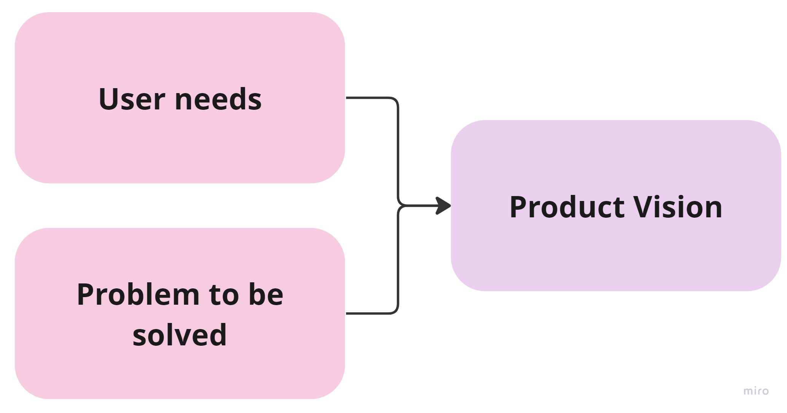
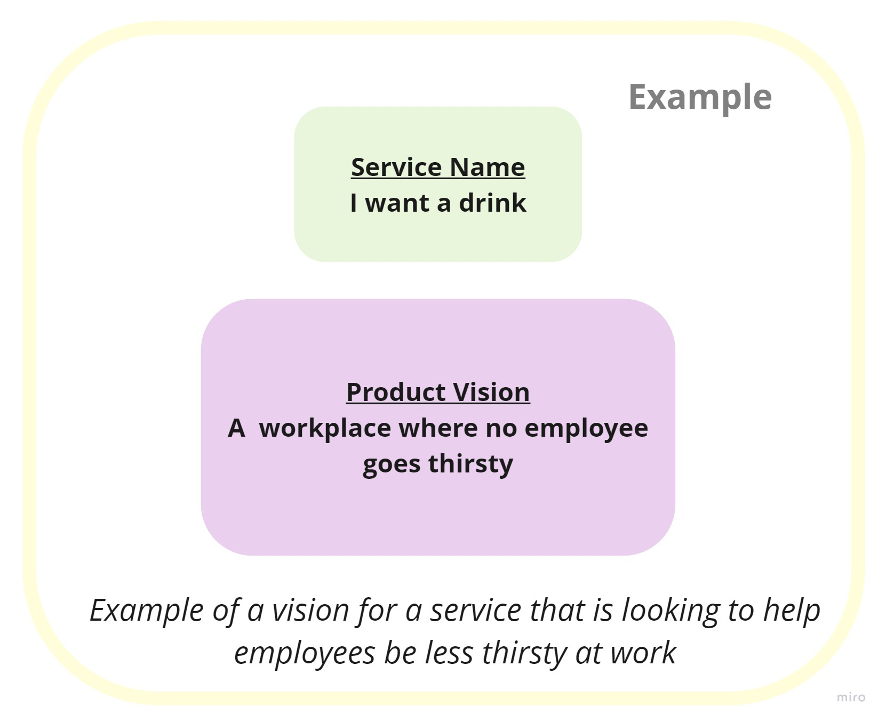
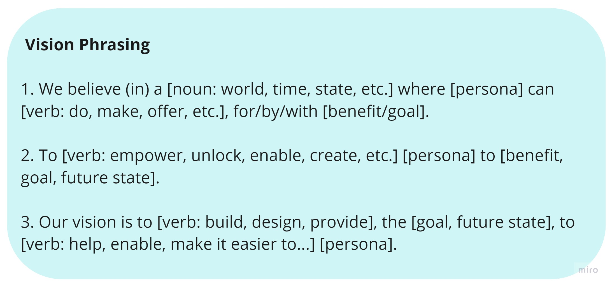

# Product Vision
## Introduction

- The product vision describes the ultimate purpose of a product and the positive change it will bring about for its users.
- A product vision should be focused, ambitious and concise (each team member should be able to remember and say it).
- It should not include assumptions about the technology, solution or how you plan on achieving it.

## Product Vision Example
To better understand the aim of a product vision here is an example. The example shows the vision for an organisation looking to the solve problem of staff complaining that they are thirsty at work:

This example vision is bold and ambitious, it could be solved with a number of different approaches and it does not contain a solution. It is important that the vision is created as a result of user needs and a problem statement (the example for these can be found in the [User Needs](user-needs.md) section of the playbook).

## Creating the Product Vision
- A vision workshop with the product team and stakeholders can be a good way to collaborate and get buy-in. Following this, the product manager can then refine the vision and ensure it is based on user needs and retains focus.
- A useful outline for a worksop and steps to co create a vision can be found [here](https://digitalhealth.blog.gov.uk/2018/07/25/how-to-co-create-a-vision-statement/) from the department of health.
- It can also be helpful to use the below vision phrasing templates to refine ideas:

## Further Information
- [Roman Pichler - 6 Qualities of a Great Product Vision](https://www.romanpichler.com/blog/six-qualities-of-a-great-product-vision/)
- [A Beginner’s Guide to Product Vision](https://www.vincelaw.co/blog/beginners-guide-to-product-vision)
- [Scrum.org - 10 Tips for Product Owners on the Product Vision](https://www.scrum.org/resources/blog/10-tips-product-owners-product-vision)

