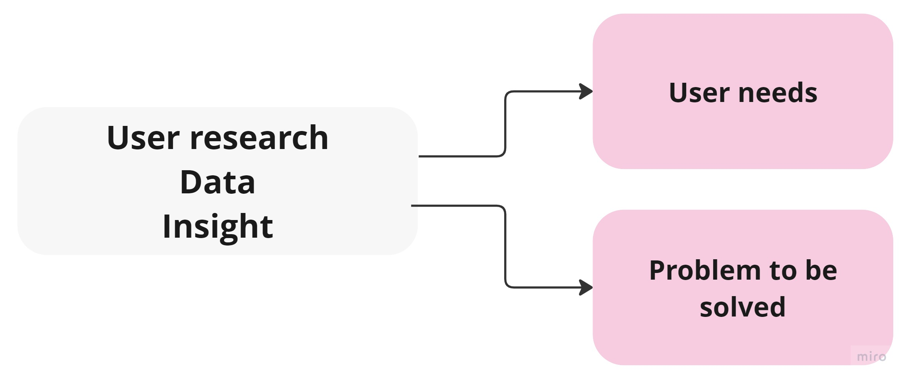
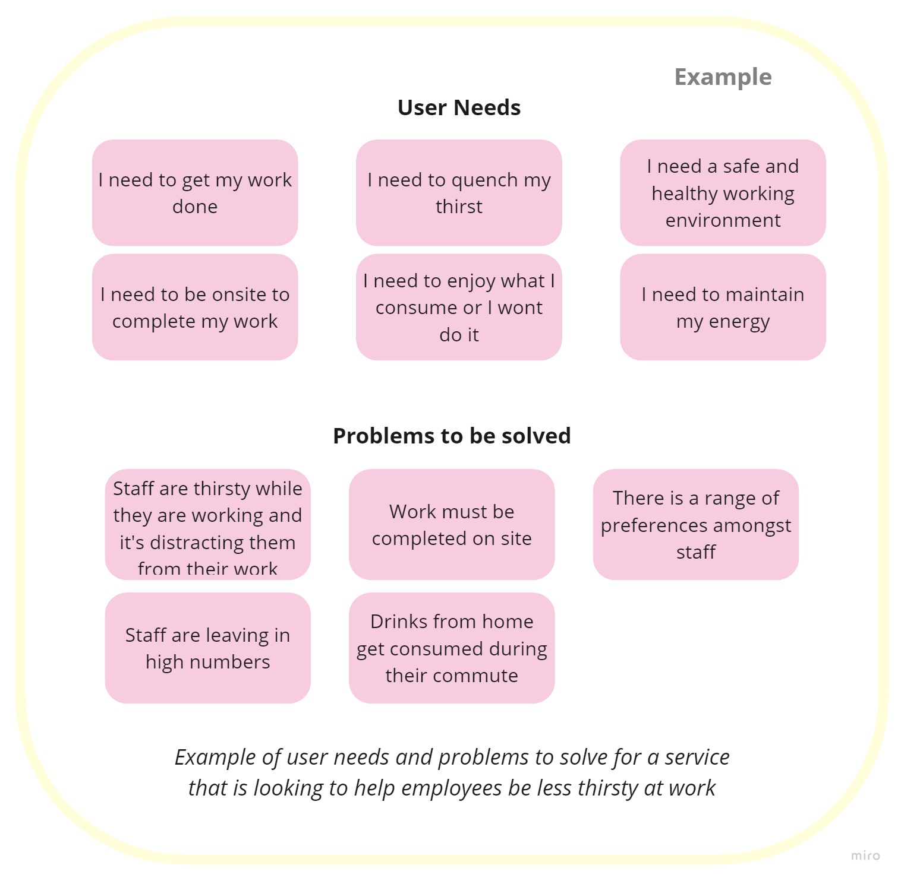

# User Needs
## Introduction

- Products should have a clear and defined set of needs for our primary users: people who live and work in hackney. Within this group, we should know who the core users are for the product or service.
- Needs should focus on the problem the user is trying to solve, jobs to be done or goals the users want to achieve.
- Needs should not include technology, possible solutions or product features.

- Needs should be gathered and validated based on user research, data and insight.
- There will also be organisational and operational service needs, which should be identified but not dominant.
- There are several ways to identify user needs, for example reviewing existing research and data (analytics, call data etc), conducting user research and talking to colleagues in Hackney who work with our users.
- It is also important to define the problems that need to be solved, these can be done as a problem statement or a simple list of problems the product is hoping to solve.

## User Needs Example
To better understand how user needs should be defined here is an example. The example shows how user needs have been captured for an organisation looking to the solve problem of staff complaining that they are thirsty at work:

The user needs get to the core motivations and needs of the user, avoiding solutions. The problem statements ensure that there is clarity in what would make the project a success.

## Further Information
- [Get in touch with User Researchers at Hackney](mailto:user.research@hackney.gov.uk)
- [#design-and-research on Slack](https://hackit-lbh.slack.com/archives/CJ6AWTH0A)
- [Hackney Council Research Library](https://research.localgov.digital/)
- [GDS Service Manual - Learning about users and their needs](https://www.gov.uk/service-manual/user-research/start-by-learning-user-needs)
- [GDS Service Manual -  User Research](https://www.gov.uk/service-manual/user-research)
