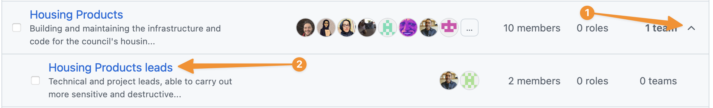

# Manage GitHub teams

This page describes how to create and manage teams, as well as deciding and managing team membership.

## Why and how we use teams

Managing individuals' access to specific repositories doesn't scale well. Instead, we group people into teams and manage those teams' access to repositories. This makes it much easier to get new starters set up correctly and manage people moving between teams.

Teams are managed in the [LBHackney-IT Teams list](https://github.com/orgs/LBHackney-IT/teams).

> ℹ️ Teams should reflect our organisation structure, so may require occasional refactoring to align them.

There are currently two main types of team in use:

1. Profession teams, e.g. [`Development Team`](https://github.com/orgs/LBHackney-IT/teams/development-team). Every member of the profession belongs in these groups, and they're used for things that are owned by the professional as a whole, for example this documentation site.

2. Project teams, e.g.  [`Targeted Services`](https://github.com/orgs/LBHackney-IT/teams/targeted-services). These project teams have a sub-team for leads, which provides elevated privileges to do more sensitive repository management.

## Adding a new user

Typically a new joiner will need to be added to at least two teams:

- The profession they belong to (e.g. [Development Team](https://github.com/orgs/LBHackney-IT/teams/development-team)), and
- One or more product teams they belong to (or the `leads` sub-team of that product).

### Adding a regular contributor

Any lead can add people to one or more of their teams.

1. In the [Teams list](https://github.com/orgs/LBHackney-IT/teams) click on the team you want to add them to, e.g. `Housing Products`.
2. Click `Add a member`
3. Search for the user's GitHub username.
4. Click `Invite`.

### Adding a lead

Leads are added in a subtly different way, in order to grant them the `Admin` role to repositories the team is responsible for. We add the lead to both the main product _and_ the leads teams, and set them as team maintainers so they can add and remove team members.

> ℹ️ A "lead" in this context is someone trusted to manage the project, and doesn't reflect a specific job title.

Any lead can add another lead, or this can be carried out by a GitHub admin, e.g. the Head of Engineering.

1. In the [Teams list](https://github.com/orgs/LBHackney-IT/teams) find the team you want to add them to, e.g. `Housing Products`.
2. Click the disclosure arrow on the right hand side (next to `X teams`, and click the relevant "... leads" team).
    , and add the user:
    1. Click `Add a member`.
    2. Search for the user's GitHub username.
    3. Click `Invite`.
3. Change their role to 'Maintainer' for the team:
    1. Click the check box to the left of the user.
    2. Click the `1 member selected` drop-down.
    3. Click `Change role`.
    4. Select `Maintainer`.
    5. Click  `Change role`.
4. Go to the parent team (e.g. `Housing Products`), and add the user:
    1. Click `Add a member`
    2. Search for the user's GitHub username.
    3. Click `Invite`.
5. Change their role to 'Maintainer' for the team:
    1. Click the check box to the left of the user.
    2. Click the `1 member selected` drop-down.
    3. Click `Change role`.
    4. Select `Maintainer`.
    5. Click  `Change role`.
