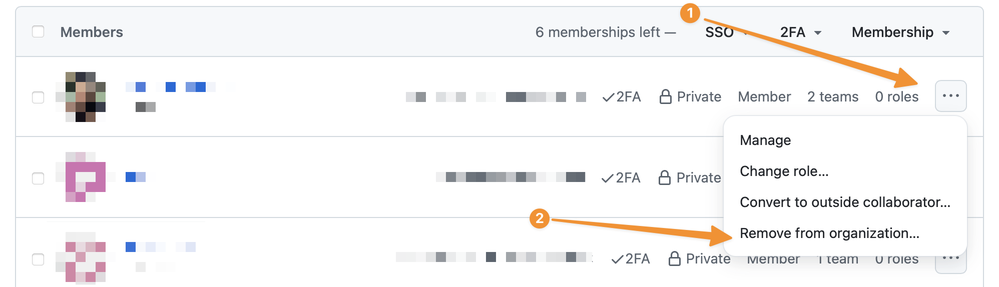

# Remove a user from GitHub

There are a couple of scenarioes where we will remove someone from the `LBHackney-IT` GitHub organisation:

- They leave Hackney
- They no longer contribute to engineering projects or don't need access to GitHub anymore.

There are two workflows: one for users with Hackney accounts and one for those that don't ([outside collaborators](#outside-collaborators)). Always prefer the Hackney Google account route where possible.

## Staff and users with Hackney Google account

### Prerequisites

1. The `Manager` role in [SAML-Github-Users](https://groups.google.com/a/hackney.gov.uk/g/saml-github-users/members), which includes the Head of Engineering and Lead Engineers.
2. The `Owner` role on the `LBHackney-IT` organisation (as of 2024 that's the Head of Engineering and some Lead Engineers).

### Steps

1. Remove the person from the [`SAML-Github-Users` Google Group](https://groups.google.com/a/hackney.gov.uk/g/saml-github-users/members).

2. Find the user in the [People list](https://github.com/orgs/LBHackney-IT/people), click  the `...` dropdown, then select `Remove from organization`:

> ℹ️ It's necessary to remove the user from both Google _and_ GitHub to ensure all access is revoked in a timely fashion and they cannot re-join the GitHub organisation.

## Outside collaborators

It is possible to remove people from individual repositories, however the process described here requires fewer steps.

### Prerequisites

1. You must have the `Owner` role on the `LBHackney-IT` organisation (as of 2024 that's the Head of Engineering and some Lead Engineers).

### Steps

> ℹ️ These steps are also described in the [official GitHub documentation](https://docs.github.com/en/organizations/managing-user-access-to-your-organizations-repositories/managing-outside-collaborators/removing-an-outside-collaborator-from-an-organization-repository), which includes alternative instructions to remove people from individual repositories.

1. Visit [`People` -> `Outside collaborators`](https://github.com/orgs/LBHackney-IT/outside-collaborators).
2. Select the people you'd like to remove from the organisation.
3. Above the list of outside collaborators, select the `X collaborators selected...` dropdown menu, and click `Remove from all repositories`.
4. Review the confirmation notice and confirm by clicking `Remove outside collaborators`.
