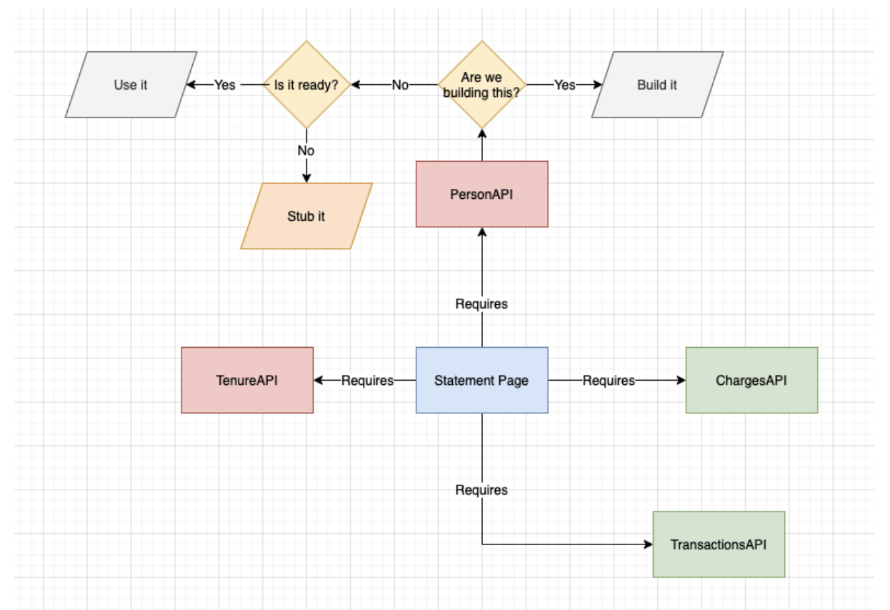
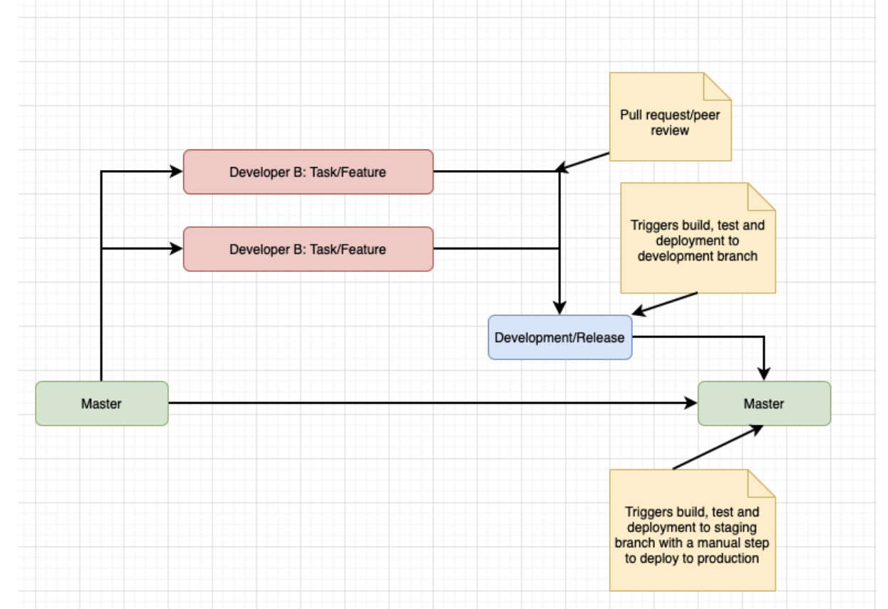

# Our Ways of Working

## Planning/Prioritisation

a. What are the  user and data needs
b. What about the other work streams - what impact on our planning/prioritisation. Are there any dependencies or crossovers?
c. What task can we pick up that adds the most value or has the most urgent dependencies - scoring
d. Add to project board Trello/Clickup/Jira - This is how we share what we are doing and our progress (specific to development).
e. What are our dependencies?
  i. Do we have what we need ie - common APIs
  ii. If no API is there a specification (Swagger doc) we can use to stub until it is available?

## Weekly task allocation/review

1. What’s outstanding from the previous sprint/week?
2. What’s next?
3. Who’s available?

## Development process

Branching strategy based off the API playbook - https://playbook.hackney.gov.uk/API-Playbook/branching_strategies/#gitflow

1. Daily stand-ups  (5 - 10 minutes) - What is everyone doing, is anyone blocked?
2. TDD - Git Branch -> Test -> Code
3. Pull request/Peer Review - Frequent
4. Release
5. Rinse and repeat - start process on next task

## API development starting point

- API boilerplate - https://github.com/LBHackney-IT/lbh-base-api
